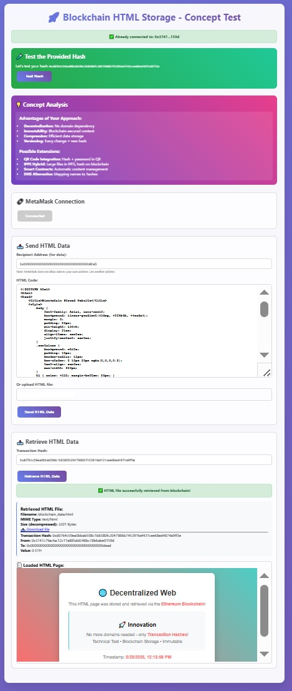

# Blockchain-Based HTML Storage System

## Overview

This project implements a decentralized HTML storage and retrieval system using blockchain technology. Instead of relying on traditional web hosting and domain systems, HTML content is stored directly on the blockchain and accessed via transaction hashes.

## Screenshots

### Main Interface

*The application's main dashboard showing connection status, storage, and retrieval sections*

### Storage Process
  
*HTML content input and compression before blockchain storage*

### Successful Storage

*Transaction confirmation with generated hash for content retrieval*

### Content Retrieval

*Retrieved HTML content displayed in iframe with transaction details*

### Live Website Demo

*Example website loaded from blockchain storage showing the decentralized content*

### Test Hash Feature

*Built-in test functionality demonstrating the proof of concept*

## Technical Architecture

### Core Components

- **Web3 Integration**: Browser-based wallet connectivity using the EIP-1193 standard
- **Data Compression**: LZ-String compression algorithm to minimize blockchain storage costs
- **Transaction Storage**: HTML content encoded as hexadecimal data in blockchain transactions
- **Content Retrieval**: Transaction hash-based content access and decompression

### Storage Format

The system uses a structured data format for blockchain storage:

```
ETH_FILE_DATA:type={mime_type};name={filename};data={compressed_base64_content}
```

- **Prefix**: `ETH_FILE_DATA:` identifies the data format
- **Metadata**: MIME type and filename for proper content handling
- **Content**: Base64-encoded, LZ-compressed HTML data

### Size Limitations

- Maximum compressed content size: 90 KB
- Compression ratio typically achieves 60-80% size reduction
- Suitable for small to medium-sized web applications

## Network Compatibility

### Current Implementation
- **Primary Network**: Ethereum Sepolia Testnet
- **Transaction Type**: Standard ETH transactions with data payload
- **Gas Optimization**: Minimal transaction value (0 ETH) to reduce costs

### Layer 2 Migration Potential

For production deployment, consider migrating to Layer 2 solutions:

#### Polygon Network
- **Advantages**: Lower transaction fees (~$0.001 vs ~$1-5 on mainnet)
- **Speed**: 2-second block times vs 12-15 seconds
- **Compatibility**: Full EVM compatibility, no code changes required
- **Scalability**: Higher throughput for frequent content updates

#### Other L2 Options
- **Arbitrum**: Optimistic rollup with lower fees
- **Optimism**: Fast finality and reduced costs
- **Base**: Coinbase's L2 solution with growing ecosystem
- **zkSync**: Zero-knowledge proof-based scaling

### Network Migration Considerations

```javascript
// Example network configuration for Polygon
const polygonConfig = {
    chainId: '0x89',
    chainName: 'Polygon Mainnet',
    nativeCurrency: {
        name: 'MATIC',
        symbol: 'MATIC',
        decimals: 18
    },
    rpcUrls: ['https://polygon-rpc.com/'],
    blockExplorerUrls: ['https://polygonscan.com/']
};
```

## Technical Features

### Compression System
- **Algorithm**: LZ-String for optimal text compression
- **Encoding**: Base64 for blockchain compatibility
- **Efficiency**: Reduces storage costs by 60-80%

### Browser Wallet Integration
- **Standard**: EIP-1193 Ethereum Provider API
- **Compatibility**: Works with any standard wallet browser extension
- **Functions**: Account management, transaction signing, network switching

### Data Integrity
- **Immutability**: Content cannot be altered once stored
- **Verification**: Transaction hash serves as cryptographic proof
- **Decentralization**: No single point of failure

## Use Cases

### Development & Testing
- Rapid prototyping without server setup
- Immutable documentation storage
- Decentralized application frontends

### Production Applications
- Censorship-resistant websites
- Permanent archive storage
- Distributed content delivery
- Version-controlled web applications

## Implementation Details

### Storage Process
1. HTML content compression using LZ-String
2. Metadata prefixing with file information  
3. Base64 encoding for blockchain compatibility
4. Transaction creation with data payload
5. Blockchain confirmation and hash generation

### Retrieval Process
1. Transaction lookup by hash
2. Data extraction from transaction input
3. Metadata parsing and validation
4. Base64 decoding and decompression
5. Content rendering in isolated iframe

### Security Considerations
- **Sandboxing**: Retrieved content runs in iframe isolation
- **Data Validation**: Input sanitization and format verification
- **Network Security**: HTTPS enforcement for external resources
- **Wallet Security**: No private key handling in application

## Performance Characteristics

### Storage Metrics
- **Maximum File Size**: ~90 KB (compressed)
- **Compression Ratio**: 60-80% reduction typical
- **Transaction Cost**: Network-dependent (L1: $1-5, L2: $0.001-0.01)

### Retrieval Performance
- **Lookup Time**: Network block time (12s Ethereum, 2s Polygon)
- **Decompression**: Near-instantaneous client-side
- **Caching**: Browser-level caching of retrieved content

## Development Setup

### Prerequisites
- Modern web browser with Web3 capabilities
- Browser wallet extension installed
- Testnet cryptocurrency for transaction fees

### Network Configuration
The application automatically configures supported networks but can be extended for additional chains.

### Local Development
1. Clone the repository
2. Open `index.html` in a web browser
3. Connect wallet to supported testnet
4. Begin testing storage and retrieval functions

## Future Enhancements

### Potential Improvements
- **IPFS Integration**: Hybrid storage for larger files
- **Smart Contract Management**: Automated content organization
- **Domain Name System**: Hash-to-name mapping service
- **Content Encryption**: Private content with access controls
- **Batch Operations**: Multiple file handling
- **CDN Integration**: Performance optimization layer

### Scalability Solutions
- **Layer 2 Migration**: Reduced costs and faster transactions
- **Sidechains**: Application-specific blockchain deployment
- **State Channels**: Off-chain content management
- **Rollup Integration**: Bundled transaction processing

## Technical Limitations

### Current Constraints
- **File Size**: Limited by blockchain transaction size limits
- **Cost Structure**: Transaction fees for each storage operation
- **Retrieval Speed**: Dependent on blockchain confirmation times
- **Browser Dependency**: Requires Web3-enabled browser environment

### Mitigation Strategies
- **Compression**: Maximize storage efficiency
- **L2 Migration**: Reduce transaction costs significantly
- **Caching**: Client-side storage for frequently accessed content
- **Progressive Loading**: Chunked content delivery for larger applications

## Contributing

This project demonstrates the feasibility of blockchain-based content storage and welcomes technical contributions, particularly in:
- Layer 2 integration implementations
- Compression algorithm optimizations
- User interface improvements
- Security enhancements
- Performance optimizations

## License

Technical implementation available under open source licensing terms.
